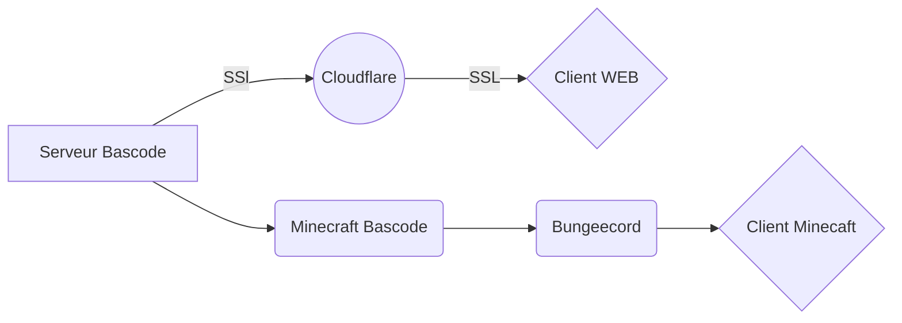

# Need-list
*Une liste des différents besoins de l'assosiation Bascode* 
| Nom du besoin 📋| Prix 💶 | Usage ⚙️| 
|--|--|--| 
| Serveur Bascode | Dédié (???) / VPS Ovh cloud (~54,99 €/mois) | Le serveur bascode sert a héberger et stocker toutes les donnés en rapport avec Bascode. Mais sert aussi a héberger le site web de Bascode, de serveur GIT Bascode et le serveur Minecraft™ Bascan. Il sert de fonsation pour tous projets entrepris par Bascode  |
| Salle dans le lycée | XXXXXXX | Une salle qui sert de point de rassemblement pour tous les membres de l'assosiation Bascode. Cette salle doit de préférence disposer d'ordinateurs et d'un vidéo-projécteur.| 

# Usage chart du serveur Bascode

